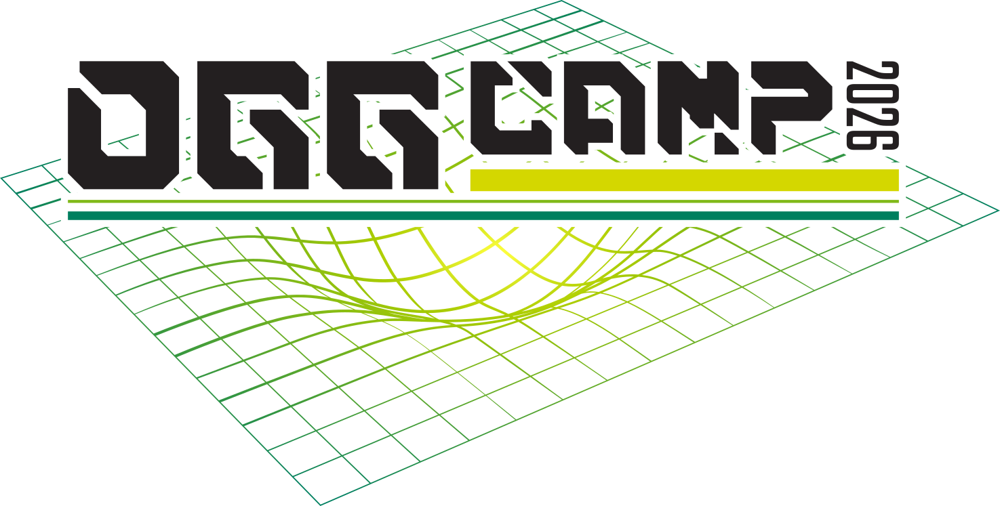

+++
author = "Dave Lee"
categories = ["Reviews"]
date = 2026-04-27T16:00:00Z
description = ""
draft = false
featuredImage = "banner.jpg"
slug = "oggcamp-2026"
summary = "As my eldest offspring and I left the house on Friday afternoon, we certainly weren't expecting fate to conspire against our actually attending OggCamp this year."
tags = ["OggCamp"]
title = 'OggCamp 2026'
+++

As my eldest offspring and I left the house on Friday afternoon, preparing to head west towards Manchester, little did we expect to be static mobile on the M62 for 30 minutes due to an accident.  Nor did we expect to be sat sitting, unmoving, on a tram for a further 30 minutes due to a points failure.  It's almost as though fate was conspiring against our actually attending OggCamp this year... as if we were going to say, "screw you guys, I'm going home".

Not a chance, fate.  Back in your box.

## WhoBob WhatCamp?

From the [OggCamp](https://oggcamp.org/) website:

> OggCamp is an [unconference](https://en.wikipedia.org/wiki/Unconference) celebrating [Free Culture](https://en.wikipedia.org/wiki/Free-culture_movement), [Free and Open Source Software](https://en.wikipedia.org/wiki/Free_and_open-source_software), [hardware hacking](https://en.wikipedia.org/wiki/Hacker_culture), [digital rights](https://en.wikipedia.org/wiki/Digital_rights), and all manner of collaborative cultural activities.
>
> *(links to Wikipedia articles in the above excerpt were added by me)*

## The event

So this year, as the previous two times, OggCamp was hosted in the [Pendulum Hotel/Manchester Conference Centre](https://pendulumhotel.co.uk/), right in the centre of the city.  It's called the Pendulum, as it has a Foucault pendulum in the centre of the building (although, controversially, it might not actually be a Foucault... just reminiscent of one #NotAnExpert)

The event works something like this:  
*(see the [Talk Guidelines](https://www.oggcamp.org/guidelines/) page for a more detailed description)*

##### Scheduled track

The scheduled track is determined in advance of the event by speakers submitting the details of their talk as part of a [Call For Papers](https://www.oggcamp.org/posts/cfp/).  The idea behind the scheduled track in an event that is - by design - unscheduled, is that there will at least be *something* that you can go to see.

##### Unscheduled track

The unscheduled track - as the name suggested - is *not* determined in advance of the event.  In fact, talks can be proposed mere minutes before they're due to start.  This is not advisable, however, unless you have hoards of followers literally waiting for you as you put the sticky note on the board!  However, if you're not regularly looking at the board, it would be very easy to miss a talk that you may have been interested in.

I'm narfed if I can find an actual picture of the unscheduled topic board, so here's a random one from Wikipedia's [Unconference](https://en.wikipedia.org/wiki/Unconference) page for illustrative purposes:

There was also a digital version of the scheduled and unscheduled tracks on the [Talk Schedule](https://talks.oggcamp.org/oggcamp-2026/schedule/) page, which was being kept up to date by the OggCamp Crew.

##### Impromptu track

Actually, I'd really love it if the impromptu track became a "thing".  I think that every year there have been talks that haven't even made it into board because they've happened at such short notice that *no-one* knew about them!  For example, there's almost always been a podcast recording of some description (like [Linux Lads](https://linuxlads.com/) did this year), a talk about Amateur Radio in the lobby of the Charles Street Building in 2018, a conversation about a potential kids track whilst loitering outside the toilets at the Oxford Hotel in 2014.  I'm only mentioning these because I participated, attended, or executed (in that order) them.

My comment about this becoming a "thing" might have confused you... by definition, it cannot become a "thing" because it's impromptu by design.  However, it would be amazing to have the capability to retrospectively log somewhere "this is what I did" in addition to the "this is what I want to do" aspect of the scheduled and unscheduled tracks... *particularly* if there's a way to reference slides, a recording, or whatever off the back of it.  This could also provide inspiration for talks in future OggCamps.

##### Social track

And here we come to the real crux of OggCamp, and the reason why I attend this event... the people.  As I have mentioned many times to various people, and also in the Linux Lads recording I mentioned in the Impromptu track above, if I come to OggCamp, earmark a bunch of talks to go to, but end up going to none of them because I've been too busy talking to people, then I will leave a happy man.  The networking aspect of OggCamp, the meeting of minds, having a laugh with friends - old and new - over a pint or coffee (or a pint of coffee); that's why I go.

## Standouts and takeaways

##### The people

It would take ages to call out everyone that I interacted with over the weekend, but in addition to my actual family (pictured in the reflection of the pendulum at the top of this post), plus Luke's friend Cody (far left in the same picture), there was also [Al Christman](https://al.christman.co.uk/) (of [TuxJam](https://tuxjam.otherside.network/) and [Admin Admin Podcast](https://adminadminpodcast.co.uk/) fame) and his son Oscar, [Dom R](https://github.com/shymega), Pete Winkley MØOEM (who I know from the Amateur Radio community, but I didn't know he was even coming to OggCamp until the Friday night), [Monica Ayhens-Madon](https://layer8.space/@communiteatime), [Martin Wimpress](https://wimpress.com/), [Jon "The Nice Guy" Spriggs](https://jon.sprig.gs/), [Dan Lynch](https://danlynch.org/), the [Linux Lads](https://linuxlads.com/): [Shane Kitt](https://strandedoutput.com/) and [Conor Murphy](https://mastodon.ie/@techcelt)... I've probably offended some people by missing them off the list.

##### The talks

I signed up for many more talks than this, but there's only one of me (thankfully!!), but these were just some of the ones that I attended that really stood out for me:

- [**What is an Engineering Office (and why??)**](https://talks.oggcamp.org/oggcamp-2026/talk/ZVHKPH/)  
  A great insight into how an Engineering Office works, the tools they use, and the methodologies they employ.
- [**Infrastructure as Code is Cool**](https://talks.oggcamp.org/oggcamp-2026/talk/NPVEZ3/)  
  A highly-entertaining and incredibly informative look at [Ansible](https://docs.ansible.com/) and [IaC](https://en.wikipedia.org/wiki/Infrastructure_as_code) in general.  During this talk, [Charlie](https://awfulwoman.com/) actually destroyed the VM running her own website in production, and then recreated it using Ansible... whilst we all perched on the edges of our seats in horror and trepidation!
- [**CodeCAD - Make 3D Designs from Code**](https://talks.oggcamp.org/oggcamp-2026/talk/S9SWVH/)  
  A primer into [OpenSCAD](https://openscad.org/) (which I already use extensively), and [Build123D](https://build123d.readthedocs.io/) (which I'd never heard of before this session)
- [**Linux Lads podcast recording**](https://linuxlads.com/)  
  An impromptu (see above) recording of [Linux Lads](https://linuxlads.com/), featuring [Shane](https://strandedoutput.com/) and [Conor](https://mastodon.ie/@techcelt), and guesting myself, [Caroline "the wife" Lee](https://carolinelee.co.uk/), [Dan](https://danlynch.org/), and [Al](https://al.christman.co.uk/).  Available on all good podcatchers soon (and [also on the livestream recording](https://www.youtube.com/live/6b9CzqFgfA4?t=12189))

##### The takeaways

OggCamp is a phenomenal event, and clearly of benefit to a good number of people all around the world who feel the need to travel for goodness knows how many hours and modes to meet up with a bunch of geeks and nerds in little ol' England.  This is a significant event in many calendars - over 200 of them, to be a little more specific.  In fact, the event has the capacity for growth well beyond its current numbers, and I already know of at least 5 people who couldn't make it this year due to other unavoidable circumstances.

A small number of little birdies have planted the suggestion in my head that we need more people to help out with the planning, organisation, and delivery of future OggCamps

## Thanks

- to everyone I spoke to during the OggCamp 2026 weekend (whether I mentioned you above or not)
- to the Linux Lads for letting us crash their podcast recording
- to Gary, Joe, Andy, May, and the entire OggCamp Crew of volunteers
- to the team at the Pendulum Hotel (particularly the barkeep who poured me the *perfect* pint of Guinness!)
- to the guy from Collabora who kept giving us [~~tribbles~~](https://memory-alpha.fandom.com/wiki/Tribble) beavers
- to my amazing family who have absorbed (and tolerated) my enthusiasm for this event

... you made this event for me, and I thank you for it.

Oh, and please forgive the two-inch thick layer of dust on this blog.

## Shameless plugs

If you didn't attend the Linux Lads recording - and I know that most of you didn't - you would have missed the despicably shameless plugging of a whole bunch of podcasts.  So by way of a PSA, here they are again!

- [**The Bugcast**](https://thebugcast.org/)  
  An award-winning podcast that has been gracing the podwaves since 2008 with its unique mix of waffle and music from independent and Creative Commons artists.
- [**TuxJam**](https://tuxjam.otherside.network/)  
  A family-friendly show which takes a look at some of the application and distros that have been released in the open source community and mixes in a variety of music to make the show both informative and entertaining.
- [**Admin Admin Podcast**](https://adminadminpodcast.co.uk/)  
  A podcast for people who work in the Real world of IT.
- [**Linux Lads**](https://linuxlads.com/)  
  Four ~~*ultimate Linux ninja experts*~~ Linux users who like to talk about it. A lot.
- [**Hacker Public Radio**](https://hackerpublicradio.org/)  
  A technology focused podcast that releases shows every weekday Monday to Friday. Our shows are produced by listeners like you and can be on any topic that is of interest to hackers, hobbyists, makers, etc.

## And finally

If you weren't able to get to the event yourself, or even if you did and you missed a main stage talk or want to watch one again, you can check out the following YouTube links:

- **OggCamp 2026 - Day 1 - Saturday** [ [talks playlist](https://www.youtube.com/watch?v=dvxmNbpGLY0&list=PLSLmz0F5br0Xw1L-3LeODx390NE_EhJrE) | [unedited video stream](https://youtu.be/OJko-rSgKVc) ]
- **OggCamp 2026 - Day 2 - Sunday** [ [talks playlist](https://www.youtube.com/watch?v=eWIRX4579NY&list=PLSLmz0F5br0UoxIM_2c1xSb51f-pRLhV-) | [unedited video stream](https://youtu.be/6b9CzqFgfA4) ]

---

*Post image by taken by [@moosical](https://mastodon.me.uk/@moosical) under the [Foucault pendulum](https://en.wikipedia.org/wiki/Foucault_pendulum) at the [Pendulum Hotel](https://www.pendulumhotel.co.uk/) in Manchester*
